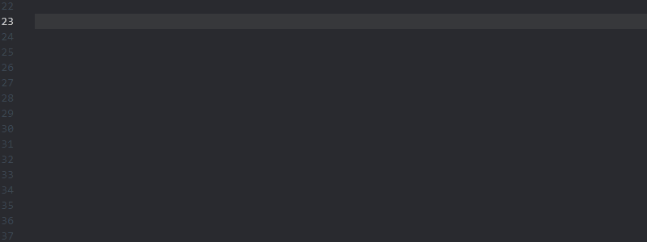
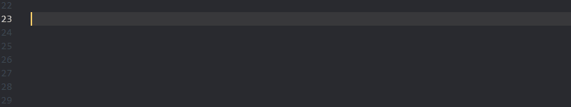
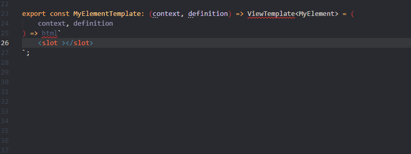
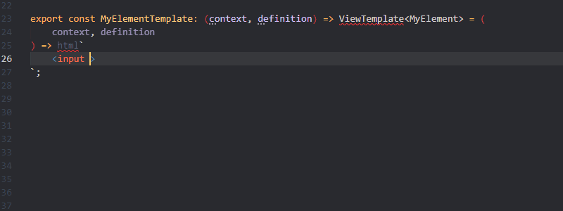

# **FAST-Snippets**
Useful vscode snippets for common patterns when creating [FAST Components](https://github.com/microsoft/fast).

## **Featured FAST snippets**
***
### Components created using `@customElement` decorator.

### FAST element template definitions

### FAST HTML Directives

### FAST Template Bindings

### **More Examples**
* [FAST Elements](examples/fast-element-classes/fast-element-classes.md)
* [Templating](examples/templating/template.md)
	* [Directives](examples/templating/directives.md)
	* [Bindings](examples/templating/bindings.md)
* [Styling](examples/styling/styling.md)

## **Known Issues**
***
* Due to a limitation with vscode, import directives do not get auto-generated for symbols in snippets that are from external packages.

	vscode issue [here](https://github.com/microsoft/vscode/issues/111007).

## **Release Notes**
***
### 1.0.0
* Initial release
* Snippets for:
	* FAST custom element definitions with & without decorator syntax
	* FAST FoundationElement definitions
	* FAST element templates
	* FAST HTML directives
	* FAST template bindings
	* FAST element styles
