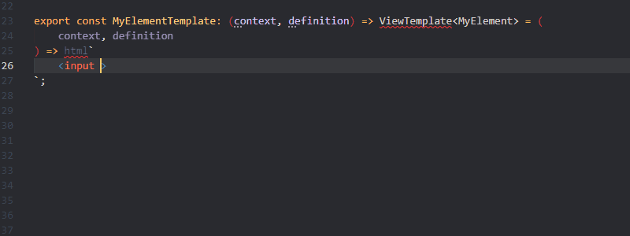
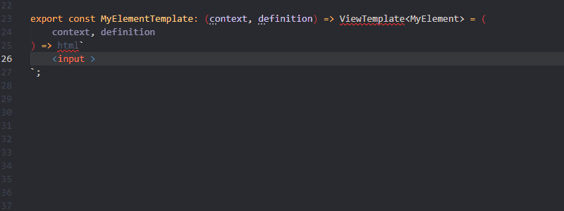

# FAST Template Bindings

## Basic Binding
	prefixes: "fast","binding","bind"

## Boolean Binding
	prefixes: "fast","?","bool","boolean","binding","bind"

## Property Binding
	prefixes: "fast",":","binding","bind","property","prop"

## Event Binding
	prefixes: "fast","@","event","binding","bind"
