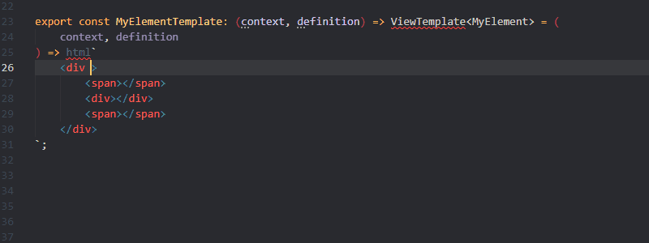

# FAST HTML Directives

## When directive
	prefixes: "fast","when"

## Ref directive
	prefixes: "fast","ref"

## Repeat directive
	prefixes: "fast","repeat"

## Slotted directive
	prefixes: "fast","slotted"
### Unfiltered

### Filtered

## Children directive
	prefixes: "fast","children"
### Unfiltered

### Filtered
